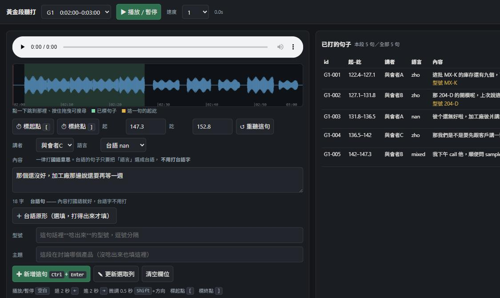

# meeting-asr-kit

**如何產出一份可交付的會議紀錄與逐字稿，並讓它成為你工作專案的 ground truth。**

多人、多語、單點收音的會議。
轉錄誰都會跑，
難的是，那份稿子是否可以被視為可信任的文件。

而會議紀錄發出去之後就不只是一份文件了。
之後每一次「當初講好的是什麼」、「那個規格誰答應的」、「這個型號是哪一版」，都回頭引用它。
它會變成那個專案的 ground truth ——
**錯誤的資訊，會在後面每一次引用放大一次。**

所以這個 repo 的重點在**一份稿子有多少能信，而且能給得出實際的數據**。

---

## Human-in-the-loop，建立一份「黃金段落」

**人聽打那一步省不掉，但可以只做一點點，然後知道剩下的能不能信。**

`transcribe_ui.py` 效益最大化；其餘的讓工具回答
「模型轉錄的那大半，到底有多準?」

---

## 這個 repo 解決的問題

一場 90 分鐘、11 個人、國台語夾雜、單點收音的會議。丟給任何引擎都會得到一份
「看起來像逐字稿」的東西。問題是：

- 它漏了多少？
- 幻覺可能出現在哪裡？
- 它把台語寫成國語了嗎？
- 專有名詞識別？
- 換一個引擎會不會比較好？

**沒有標準答案的時候，這五題一題都答不了。** 常見的替代做法是跑兩個引擎互比 ——
但兩份都錯的地方，它們會一起錯，一致不代表對，有時候是一起出現一樣的幻覺。

所以流程是這樣的：**人工聽打幾段 60 秒（叫「黃金段」），其餘全部自動化，
再用那幾段回頭量自動的部分。** 聽打是輸入，不是副產品。

---

## 黃金段落聽打，建立可信度的基礎

整條線只有這一步非人不可，所以工具卡在這裡等於卡住全部。



*畫面僅示範UI介面，資料及講者與型號都是程式產生，非真實會議。*

圖上有三件事值得指出來：

- **`語言` 選了「台語 nan」，而 `內容` 打的是國語** —— 下面那行提示寫著
  「台語句 —— 內容打國語就好，台語字不用打」。這是整個標註規格最關鍵的決定，
  理由在下方〈標註：台語只要標，不要打〉
- **波形上的綠帶是已經標好的句子**、黃線是正在標的這一句的起訖 ——
  一眼看得出這段還有哪裡沒打
- **底下那排是鍵盤操作**：空白鍵播放、方向鍵前後 2 秒、`Shift` 微調 0.5 秒、
  `[` `]` 標起訖、`Ctrl`+`Enter` 新增。手不用離開鍵盤

```bash
python transcribe_ui.py <黃金段資料夾>      # 開 http://127.0.0.1:8765
```

- `[` `]` 標起訖、空白鍵播放、方向鍵前後跳（Shift 微調），下拉選講者 ——
  **不必手寫 JSON**
- 時間戳自動換算回原檔座標（你標的是段內相對位置）
- 台語只要**標「這句是台語」**，不必打台語字（見下方〈標註：台語只要標，不要打〉）
- 存檔前跑 schema 驗證，不合格**拒絕寫入**並列出錯在哪
- 每次存檔留帶時間戳的備份、保留最近 10 份

**為什麼是本機網頁不是 .exe**：`<audio>` 給的 `currentTime` 是逐句抓時間點的關鍵，
鍵盤操作也直接；而且 Mac 也能跑。雙擊 `.bat` 的體感跟 exe 相同。

🔴 **只綁 127.0.0.1，而且擋 DNS rebinding 與 CSRF。** 這不是多疑 ——
早期版本實測 `Host: evil.attacker.com` 打 `GET /api/lines` 會回 200 ＋ 完整逐字稿，
而任何網頁都能 POST 一個空陣列，把整份稿子清掉。兩個都修了，
`tests/test_transcribe_ui.py` 起真的 server 送那些 payload 驗。

---

## 全貌

```
                     ┌─ 人做的（一次，幾段 60 秒）──────────────┐
音檔 ─> preprocess.py │  scan_levels.py   挑哪幾段（不看 ASR 稿） │
        入口正規化     │        ↓                                  │
           │          │  transcribe_ui.py 聽打 ← 只有這步非人不可 │
           │          │        ↓                                  │
           │          │  golden.py        標註規格與驗證          │
           │          └───────────────────┬──────────────────────┘
           │                              │
           ├─> chunking.py  靜音感知切段   │  黃金段
           │   （長檔用；切自然停頓，       │
           │     時間戳平移回原檔）         │
           │                              │
           └─> <你的引擎>  ────────────────┴─> score.py    評分
               Whisper / faster-whisper          └─ adjudicate.py
               / 任何會吐時間戳的東西               把「幻覺」與
                                                  「人沒打到的語音」分開
```

左邊那條是每次開會都會跑的；右邊那個框**做一次就好**，
之後換引擎、改參數、換錄音設備，都拿它來量。

---

## 從逐字稿到可交付的會議紀錄

**會議紀錄才是交付物** —— 而那一步這個 repo 沒有幫你做完，
講清楚界線比假裝它全包更有用。

**這個 repo 覆蓋的**：音檔 → 一份逐字稿 → **知道那份稿子多準，而且有數字**。

**沒覆蓋的兩件**：

### 一、術語正名表

型號、廠商、人名、日式英語 —— ASR 一定會聽錯，而它錯的方式是穩定的
（同一個詞每次錯成同一批字）。做法是一張「誤聽 → 正名」對照表，
**長的排前面**（否則短詞會先咬掉一部分，`204` 會匹配進 `204-D` 裡面），
每場冒出新的就補一條。

這張表不在 repo 裡：每家的產品名不一樣，而且那通常是公司內部資產。
但 `score.py` 的型號 precision／recall 就是在量它有沒有用 ——
**收了詞之後要能看出命中數變了**，不然你不知道自己在收什麼。

🔴 **一個實測的坑：主轉錄不要餵熱詞表。**
餵了之後，你分不出「引擎真的聽對了」還是「提示把它推過去了」。
留一條無提示的稿當對照，熱詞只用在覆核那一輪。

### 二、稿 → 紀錄那一步

用 LLM 做得動（餵逐字稿 ＋ 你的議程 ＋ 正名表，吐結構化紀錄）。
決定品質的是前面兩件：**稿夠不夠準、術語有沒有對**。
兩個都沒把握的時候，LLM 會把錯的東西寫得非常通順。

實際跑起來的樣子是：同一場音檔轉三到四輪（不同引擎、原檔與正規化各一），
交叉比對有分歧的地方，再回頭聽那幾段。
會議紀錄本身的整理時間從兩三小時壓到可接受，
而**壓得掉的原因是你知道哪幾段需要人看** —— 那是前面那把尺給的。

---

## 立刻能用的一件事（不必裝這個 repo）

如果你只想解決「引擎吃掉了大半段音訊」，先做這個：

```bash
ffmpeg -i 原始音檔.m4a -af "dynaudnorm=f=200:g=15:p=0.9:m=30" -ac 1 -ar 16000 正規化.wav
```

低電平的錄音會讓 VAD（語音活動偵測）把整段判成非語音、根本沒餵進模型。
實測一場低電平會議：**語音覆蓋率 49.3% → 90.8%**，同一支音檔、同一個引擎，
差別只在有沒有先過這一道。

這個濾鏡只動振幅不動時間軸，所以時間戳跟原檔對得起來，之後要回聽可以直接跳。

⚠️ 但它不是萬用的。另一場收音本來就健康的會議上，同一道處理讓某個引擎的
**覆蓋率反而掉了 2.9 個百分點**。⇒ 值得做成預設，但要留 `--no-normalize` 逃生口，
而且要自己量。

---

## 七個指標，與它們各自的陷阱

| 指標 | 量什麼 | 踩過的坑 |
|---|---|---|
| `cer_content` | 內容正確率 | 逐句對齊會把**切段風格**讀成錯誤。改成逐段串接 ＋ 近似子字串對齊（兩端自由） |
| `verbosity` | 稿面膨脹率 | 🔴 **必須跟 CER 並列讀。** 兩端自由的代價是「視窗內多餘的輸出不算錯」——實測 1618 字胡言亂語包住 18 字正確答案，CER 得 **0.0000**。接近 1 ⇒ CER 可引用；遠大於 1 ⇒ 那是「最佳子字串」不是「這份稿有多準」 |
| `coverage` | 涵蓋率 | 以前都拿引擎自己的輸出當分母 ⇒ 沒有真分母。這裡分母是人標的語音秒數 |
| `hallucination` | 憑空生字 | **在非窮盡的黃金段上，它是上限，不是幻覺率** —— 人沒打到的真實語音會被算進去。用 `adjudicate.py` 拆。三種情況回 `None` 而不是回一個數字：cue 太粗／來源的 cue 終點是推估的／視窗內零輸出。**判不動就說判不動** |
| `taigi_retention` | 台語忠實度 | **不需要台語標準答案**：只要人標出「哪幾句是台語」，看引擎在哪些句子上有沒有吐台語專屬字形 |
| 型號 `precision`／`recall` | 專有名詞 | 只量 recall 會鼓勵亂猜。且比對前要正規化（中文數字↔阿拉伯數字、連字號、大小寫），否則量到的是**書寫格式** |
| `rtf` | 速度 | **當場量，不可跨場次沿用。** 實測同一支腳本在記憶體吃緊時 RTF 從 0.126 掉到 0.509 |

---

## 量尺自己要先過負向測試

**這是整個 repo 最重要的一句。** 一把沒校準的尺量出來的數字，比沒有數字更糟 ——
它看起來像證據。

`tests/test_meeting_score.py::TestCalibrationGates` 全綠才准引用任何 CER
（**刻意不在這裡寫條數** —— 散文裡的數字沒有任何東西在檢查它，
這份 README 上一版就寫錯過）：

1. hyp ＝ golden 自己 → CER 0.0／覆蓋率 100%
2. 刪掉 10% 字元 → CER 落在 8–12%
3. 空稿 → CER 100%、覆蓋率 0%，而**幻覺率是 `n/a` 不是 0%** ——
   分母 0 的比值回 0 會被讀成「這家不幻覺」，等於把「量不到」講成優點
4. **時間戳整體平移 +30 秒 → 覆蓋率必須大幅下降**（不然覆蓋率根本沒在用時間軸）
5. **每個型號換成別的型號 → precision／recall 必須是 0**（不然正規化過度歸一）
6. **把 hyp 併成一顆巨大 cue → CER 不可變**（不然量的是引擎的切段風格）
7. **切更細 → 覆蓋率不可降** ＋ 兩條守這個 fixture 自己的測試（見下）
8. 一顆蓋住全段的 cue → **幻覺率必須回 None，逐段與全體都要**

### 前五條全綠，卻一個真實缺陷都沒抓到

它們的 hyp 都是拿 golden 自己變形來的，**切法與 golden 相同**，
於是「時間分桶」那一類錯誤永遠不會現形。真實資料一送進來（某家的字幕裡有一顆
**296.8 秒**的 cue）就爆掉 —— 中點篩會整顆丟掉判 CER 100%，改成重疊收又把多餘
文字算成插入判 187%。第 6、7、8 條是後來補的。

**通則：校準閘至少要有一條的 fixture 形狀跟被測對象刻意不同**，
否則它驗的是自洽，不是正確。

---

## 黃金段怎麼做

### 選段：不要看 ASR 稿來選

看了會選到「引擎已經出錯的地方」，量尺被偏誤放大。用 `scan_levels.py` 的客觀特徵
（電平、語音密度、動態範圍）＋ 你對那場會議的記憶。**選段理由要寫進 manifest。**

更好的做法是**選段與聽打分開兩個人做**：一個人選（只看聲學特徵）、另一個人盲打。

⚠️ 聲學特徵**分不出**哪裡有台語、哪裡在搶話、哪裡講到專有名詞 ——
`scan_levels.py` 刻意不幫你分類，硬猜就是在造假客觀性。

### 標註：台語只要標，不要打

每句六個欄位（起訖秒、講者、語言、內容、原語形式、型號），用上面那支工具填。

**台語的欄位是選填的。** 原設計要人把台語寫成漢字，作廢了 ——
多數人不會打台語中打，而由工具從國語回譯來補那一欄
**等於自己製造標準答案**（引擎寫出另一個同樣正確的台語形會被判成錯）。
改成只要標「這句是台語」，忠實度用不需要參考答案的 `taigi_retention` 量。

### 幾段才夠

**取決於你要回答什麼，而不同問題要的東西不一樣：**

| 你想知道 | 需要的不是更多段，而是 |
|---|---|
| 哪個引擎比較準 | **更多獨立 cluster**（5 段的符號檢定 p 下限 0.063，永遠到不了 0.05） |
| 專有名詞認得幾個 | **特定材料**（實測一整場 170 個窗，142 個完全沒出現型號） |
| 有沒有幻覺 | **窮盡標註**（逐秒判有沒有人在講話），跟「多標幾段聽得懂的句子」是兩種工作 |

⇒ **「多加一段」不是自動的下一步。** 投人力之前先問：缺的是段數、材料、還是標註方式。

---

## 量尺自己被獨立審計之後（三條最可轉移的）

這把尺上線當天就跑了三軌獨立審計（兩軌 AI code review ＋ 一軌資安），
三軌都判 REJECT，合計 16 條可重現的缺陷。最值得帶走的三條**跟 ASR 無關**：

### 一、同一個判定有四份實作，而第一份的 docstring 就寫著「不該有第二份」

「這顆 cue 有沒有碰到這個區間」在 `score.py` 裡有四份實作：視窗選取、覆蓋率、
台語保留率、幻覺判定。只有第一份處理了「零長度 cue」這個邊角
（某些來源的時間戳只有秒精度，兩人同秒交替就撞成零長度）。後果：

    同一顆零長度 cue（文字完全正確、落在句子正中間）
      視窗選取 → 收下（CER 吃到了）
      覆蓋率   → 丟掉
      台語保留 → 丟掉
      幻覺判定 → **一律判成幻覺**

最後一條最貴 —— 而偏差方向是固定的：只罰時間戳精度差的那一家。
第一份實作的 docstring 親手寫著「真正該消掉的是能有第二份實作這件事本身」，
而第二份就在同一個檔往下三個函式。**判定要收成一支函式，不是在註解裡請求自律。**

### 二、一道閘可以對它自己 docstring 指名的那個缺陷恆綠

覆蓋率的閘寫著它在防「初版要求單一 cue 蓋住黃金句 ≥50%」。它的 fixture
把每顆 cue 對半切，而 cue 與句子邊界完全對齊 ⇒ 每一半剛好佔 **50%**，
正好壓在舊規則的邊界內側。把舊的 buggy 規則實作出來餵它：

                       舊 buggy 規則   現行規則
    對半切、無縫相接        1.000        1.000   ← 舊 bug 拿滿分，閘全盲
    切三份＋留 0.3s 空隙    0.000        1.000   ← 才有鑑別力

⇒ 換 fixture 的同時要**加一條測試把舊規則實作出來、斷言它會紅**，
再加一條**守 fixture 自己的形狀**（例如「空隙至少 0.25 秒」）——
否則有人把 helper 改回無縫對半切，前一條還是綠的，閘會無聲退回恆綠。

### 三、一道 gate 可能在量「有沒有寫成那個樣子」，而不是「有沒有那個毛病」

`subprocess(text=True)` 不給 `encoding` 會拿系統 locale 解碼。在非 UTF-8 的機器上
這個失敗**完全靜默**：

    UnicodeDecodeError                 ← 在 reader thread 裡
    result.stdout    = None            ← 不是空字串
    result.returncode = 0              ← 照樣成功

守這件事的 AST 閘，對 **12 種**重現同一個毛病的寫法全部綠燈：模組別名、
`from subprocess import run`、顯式 `encoding=None`（在 AST 裡是 `Constant(None)`，
不是 Python 的 `None`）、`text=<變數>`、`getoutput`、`os.popen`、`call`、`check_call`、
以及 **UTF-8 BOM 檔**（`ast.parse` 丟 SyntaxError → 被 `except: continue` 吞掉，
而 Python 自己認得那個檔、照樣跑）。

它量的是「有沒有寫成 `subprocess.run(..., text=True)` 這個**字面形狀**」，
該量的是「這個呼叫**會不會拿 locale 去解碼**」。

這個 bug 在本 repo 的實際後果：靜音偵測回 0 個切點 → 靜默退化成固定秒數硬切，
而那個切點正好壓在黃金段邊界上。**上線之後在那台機器上從來沒真正生效過**，
而每一次執行看起來都是成功的。
`subprocess_encoding_lint.py` 是收斂後的版本，繞道語料（12 種壞、6 種好）
放在模組裡讓所有使用它的閘共用 —— 否則「其中一道比另一道鬆」會再發生。

可以直接跑：

```bash
python subprocess_encoding_lint.py            # 掃當前目錄樹
python -m pytest tests/test_subprocess_encoding.py -q
```

---

## 兩個會讓結論作廢的陷阱

### 一、報比值之前先看分子的絕對數

一次實測裡連續撤回三條結論，共同形狀都是**指標算出一個大數字，而分子只有個位數事件**：

- 「某引擎台語忠實度 375/萬，其餘 0」→ 真身是 **3 個字元 ÷ 80 字**
- 「A 的幻覺率是 B 的 17 倍」→ 被判幻覺的那幾秒裡，絕大部分**不是幻覺**，
  是人沒打到的真實語音（語音密度明顯高於全檔中位、語意與前後連貫）
- 「正規化對某引擎有害」→ n=2 場，而且兩場之間不只差一個變因

**事前登記預測救不了這個。** 登記防的是事後編故事，它完全不改善樣本量。

### 二、下負結論之前，先確認你的尺夠細

判斷「這個雙聲道錄音有沒有空間資訊」時，第一次用 16 kHz 量到達時間差，全部得 0 ——
但 16 kHz 的解析度是 1 樣本 ＝ 2.1 公分，而手機兩顆麥克風的間距就是 10 公分等級。
**用一把跟效應量同級的尺量不到，不構成證據。** 換 48 kHz 重測（0.71 公分／樣本）
才確認負結果成立。

---

## 安裝與跑法

只依賴 Python 標準函式庫 ＋ `ffmpeg` 在 PATH 上。評分與標註不需要 GPU、不需要模型。

```bash
# 1. 掃電平，挑黃金段（不看稿）
python scan_levels.py 音檔.m4a

# 2. 聽打（本機網頁，只綁 127.0.0.1）
python transcribe_ui.py <黃金段資料夾>

# 3. 評分
python score.py --golden <黃金段資料夾> --hyp <逐字稿.srt>

# 4. 把「幻覺」拆成真幻覺與人沒打到的語音
python adjudicate.py --golden <黃金段資料夾> --hyp <逐字稿.srt> --audio 音檔.m4a

# 測試（校準閘在 TestCalibrationGates 裡）
python -m pytest tests/ -q
```

`score.py` 吃 `.srt`、Whisper 風格的 `.json`、以及 `{start, end, text}` 的 list。

---

## 授權

MIT
